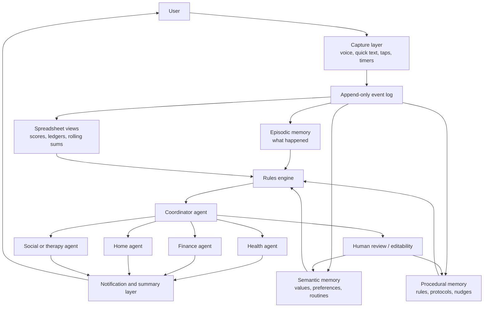

# Personal Institutional Layer for Executive Continuity

## Executive summary

The user’s problem shape is real, coherent, and clinically legible. What it most resembles is not simple “lack of discipline,” but a **persistent breakdown in continuity of goal pursuit** across domains that all require the same hidden machinery: prospective memory, task initiation, planning, prioritization, time estimation, effort allocation, emotional recovery after lapses, and maintenance of external systems over months. That profile is highly compatible with **adult ADHD-like executive dysfunction**, but it can also be amplified by depression-spectrum motivational impairment, fatigue, negative affect, burnout, or high-friction environments. In other words: the common failure mode is not failure to care; it is failure to reliably carry intentions forward through time. citeturn37view2turn38search13turn38search3turn17search3turn17search14

The strongest empirical direction is not “build a smarter task list.” It is to build a **personal institutional layer** that reduces dependence on moment-to-moment willpower by externalizing memory, state, rules, and recovery procedures. Research is most supportive of combinations of low-friction self-monitoring, clear environmental cues, structured follow-up, supportive accountability, personalization, and compassionate lapse recovery. Clinical guidance for adult ADHD also points toward **holistic treatment plans**, continuity of care, environmental modifications first, medication when indicated, and structured ADHD-focused psychological intervention with regular follow-up. citeturn37view2turn37view0turn31view19turn33view6turn7search1turn35view5

Your proposed architecture—**coordinator + per-goal agents + shared spreadsheet-like ledger + memory + nudging + summaries + adaptive choice architecture**—is pointing in a good direction. The high-confidence part is not the full “agentic life manager.” The high-confidence part is the **scaffolding pattern underneath it**: externalized ledgers, low-friction capture, adaptive reminders, cross-domain review, and accountability loops. The riskiest part is full autonomy and persistent memory without strong guardrails, because today’s assistant research still shows weak benchmarking for personalized assistants, long-context fragility, privacy concerns, and sparse longitudinal evidence that AI stewards improve real life functioning over months. So the build is promising, but the trustworthy version should begin as **adaptive scaffolding**, not an omnipotent manager. citeturn34view0turn34view2turn34view3turn33view7turn30search1turn30search2

The most important design conclusion is this: **the product should optimize continuity, not intensity**. The best version is not the one that asks for the most data or produces the most elegant ontology. It is the one that survives bad days, protects against shame, keeps state coherent, and gets you back into motion after a lapse. That means mercy primitives, anti-gaming logic, contextual notification design, minimal data-entry burden, strong audit trails, and explicit separation between supportive coaching language and deterministic rules/scoring. Those are not niceties; they are core safety and efficacy features. citeturn33view0turn33view2turn10search16turn22search3turn22search8turn23search14turn23search20

## Problem framing and terminology

A precise way to describe the user’s difficulties is **executive continuity failure**: repeated loss of state across time in domains where goals are known, values are present, and plans may briefly exist, but the chain from intention to execution repeatedly snaps. This is not a formal diagnosis, but it is a useful systems lens for problems involving mess, weight regain, bed-rot/inactivity, stalled hobbies, financial drift, slow therapy generalization, and weakening social/romantic follow-through. Research on adult ADHD supports the relevance of executive function deficits, prospective memory problems, emotional regulation difficulties, treatment-adherence difficulties, and the importance of structure in daily activities and continuity of care. citeturn37view2turn38search13turn38search3turn36view3

In formal clinical terminology, **adult ADHD** is a neurodevelopmental disorder whose impairments frequently extend beyond the core symptom labels into organization, time management, motivation, adherence, emotional regulation, and functioning across work, relationships, and daily life. NICE recommends comprehensive, holistic shared treatment plans that address psychological, behavioral, occupational, and educational needs, and explicitly notes that adults with ADHD can have difficulty adhering to treatment plans because of the symptoms themselves. NICE also advises discussing how ADHD affects relationships and emphasizes “the importance of structure in daily activities.” citeturn37view2

At the cognitive level, **executive dysfunction** usually refers to impairments in top-down control processes such as inhibition, working memory, planning, set-shifting, and monitoring. A classic meta-analysis in adults found medium-sized deficits in multiple executive domains, including verbal fluency and other executive measures, while more recent reviews continue to treat executive dysfunction as central to adult ADHD—though not every adult with ADHD shows every deficit on every laboratory test. citeturn38search13turn38search9turn38search1

A especially useful construct here is **prospective memory**, meaning memory for future intentions: remembering to do something later, in the right context, without being re-prompted by the original intention. Adults with ADHD show deficits in everyday prospective memory, including recalling and executing their own real-life intentions, and work suggests that much of the impairment comes from problems in **task planning and plan adherence**, not just storage failure. That makes the user’s description—of plans regularly evaporating in the wild—highly consistent with the literature. citeturn38search3turn38search15

Your “personal institutional layer” maps strongly onto the literature on **externalized cognition** or **cognitive offloading**. This is the use of reminders, lists, alarms, notes, ledgers, and digital systems to reduce internal cognitive load and move fragile intentions into the environment. A recent interdisciplinary review describes digital tools as participating in semantic, episodic, and prospective memory externalization, while experimental work shows that reminders can materially improve remembering. But the same literature also shows that people may overuse reminders relative to what is optimal, which means that offloading works best when it is purposeful and well-calibrated rather than indiscriminate. citeturn7search1turn35view5turn7search22

The phrase **choice-architecture failure** is also useful here, though it is more a synthesis than a standard diagnosis. In this context it means the environment, reminder system, and incentives are not carrying enough of the execution burden. The evidence base supports the idea that self-control often works better through **situation modification, prompts/cues, precommitment, social support, and externalized structure** than through repeated in-the-moment inhibition alone. citeturn25search2turn31view19turn33view4turn35view8

## Causal mechanisms behind the breakdown

The user’s pattern is best explained by an interaction of **executive control limits**, **effort-cost computation**, **affective state**, and **environmental affordances**. ADHD research has long implicated prefrontal/executive control systems in planning and regulation, while depression and anhedonia research implicate reward-related and effort-allocation systems. When those pressures stack, even simple actions can begin to feel unlaunchable. citeturn36view3turn17search3turn17search11

From the ADHD side, there is strong evidence that functioning problems often arise when the person must **self-initiate**, remember delayed intentions, manage multiple competing cues, or maintain plans across time. NICE’s treatment guidance emphasizes environmental modifications before medication, and work-related reviews note that the literature is still thin on workplace-specific supports even though ADHD affects an estimated 3.5% of the global workforce and is associated with work-performance and job-retention problems. That is exactly the kind of gap a “personal institution” is trying to fill: not more insight, but more scaffolding in the actual contexts where performance lives or dies. citeturn37view2turn36view1turn36view0

From the motivational side, there is a large literature showing that **anhedonia, fatigue, and altered effort-cost processing** can make action initiation degrade even when the person still endorses the goal. Reviews of depression-related motivational dysfunction emphasize reward-processing abnormalities and unmet treatment needs around motivation itself, while digital behavioral activation shows short- to mid-term benefits that tend to attenuate over longer horizons. “Bed rot” is not a clinical term, but the clinically relevant constructs underneath it are prolonged inactivity, avoidance, low activation, fatigue, and low reward expectation. citeturn17search3turn17search10turn17search14

The home environment matters because it is not merely a backdrop; it is part of the control system. Research on clutter shows that **subjective clutter strongly predicts lower wellbeing**, even in non-clinical populations, and that clutter is experienced subjectively rather than just volumetrically. At the same time, one study found that being in a cluttered room did not itself impair attention performance in the lab, which is an important nuance: clutter may not mechanically destroy cognition in every setting, but it does appear to increase stress, reduce subjective capacity, and degrade the felt usability of the environment. That difference matters for design: the target is not perfectionist minimalism, but enough environmental order that cues can actually function. citeturn35view3turn35view4

The downstream problems the user named also line up with known correlates of adult ADHD-like dysfunction. Meta-analytic evidence links adult ADHD with higher odds of obesity, with pooled adult odds ratios around 1.55 and pooled obesity prevalence substantially higher in adults with ADHD than those without. Narrative and review work on romantic relationships also points toward more interpersonal impairment, more conflict, lower relationship satisfaction, and less stable relationships in adults with ADHD. These are not peripheral consequences; they are often the life areas where continuity failure becomes most painful. citeturn38search0turn38search12turn38search2turn38search22

The final mechanism is **system decay through cognitive overhead**. Many people can build a tracking system for a few weeks. Far fewer can maintain the system that maintains the life. This is the core design challenge. App-abandonment research shows a curvilinear dropout pattern with sharp early losses, and bursty use of digital interventions commonly decays because of friction, poor experience, time cost, technical issues, privacy concerns, and mismatch with changing goals. That finding points strongly toward a system that must maintain itself, absorb irregularity, and minimize upkeep. citeturn33view0turn33view1turn33view2

## What the evidence supports, what fails, and what is still frontier

A useful way to summarize the literature is that the strongest evidence does **not** support a fully agentic AI steward today. It supports a stack of older but underintegrated ingredients that your proposed system could combine better than existing products do: external reminders, self-monitoring, personalized prompts, coaching/accountability, environmental structuring, and compassionate recovery after lapses. citeturn31view19turn33view6turn35view5turn22search8

### Evidence-strength snapshot

| Intervention family | Best current read | Approximate signal | What it means for the build |
| --- | --- | --- | --- |
| Adult ADHD medication when clinically indicated | Strongest evidence for core symptom reduction in adults; NICE first-line is lisdexamfetamine or methylphenidate, with atomoxetine next-line when needed. citeturn37view0turn14search0turn14search1 | Moderate symptom effect over ~12 weeks | If untreated ADHD is present, software should be an adjunct, not a substitute |
| Structured ADHD-focused psychological support | NICE recommends structured supportive intervention with regular follow-up; CBT elements may be included. citeturn37view1 | Moderate, especially for functional coping | Your app should look more like between-session scaffolding than generic productivity |
| External reminders and cognitive offloading | Strong laboratory and ecological support for reminders improving future-intention performance. citeturn35view5turn7search17turn7search1 | Solid mechanism-level support | Build excellent reminder capture and delivery first |
| Digital self-monitoring + feedback | Strong support as a core behavior-change ingredient, but adherence decays. citeturn31view19turn32search1turn33view0 | Strong ingredient, weak persistence alone | Low-friction ledgers matter more than fancy dashboards |
| Supportive accountability / coaching | Human support improves adherence conceptually and in many designs, but implementation is inconsistent; ADHD coaching evidence remains limited. citeturn33view6turn31view3turn6search10turn6search16 | Plausibly important, under-tested | Add accountability loops, but treat them as experimental |
| JITAIs and contextual nudges | Small effects for mental health overall, more promising in some health-behavior domains; timing matters. citeturn32search11turn32search23turn10search16 | Small to moderate depending on domain | Use adaptive prompts carefully, not as a magic bullet |
| AI memory augmentation / personalized assistants | Early promising HCI studies and fast-moving systems research, but sparse longitudinal evidence and unresolved benchmarking/privacy issues. citeturn33view7turn34view0turn34view3turn30search2 | Frontier, not yet mature | Use AI for compression, drafting, and routing; be cautious with autonomy |

The underlying behavior-change ingredients with the broadest umbrella-review support are **credible source, social support, prompts and cues, graded tasks, goals and planning, feedback and monitoring, human coaching, and personalization**. Across 85 reviews and more than 865,000 participants in an umbrella review of digital health interventions for noncommunicable diseases, those components had the strongest evidence for increasing effectiveness. Another review focused on engagement similarly found repeated associations for goal setting, self-monitoring, feedback, prompts/cues, rewards, and social support. This is the clearest evidence-based recipe for your choice-architecture layer. citeturn31view19turn33view4turn33view5turn11search14turn26search5

Digital self-monitoring appears especially valuable when the system makes logging easy and connects it to feedback. In weight-loss research, higher adherence to self-monitoring of diet, physical activity, and weight is associated with greater odds of achieving at least 5% weight loss, while simplified digital self-monitoring can retain engagement and acceptability. But the companion finding is harsh: most people do not keep logging unless friction stays very low. A lifestyle and mental-health app scoping review found a median of **70% discontinuation within the first 100 days**, with abandonment driven by technical issues, privacy concerns, poor user experience, time/financial costs, and changing needs. citeturn32search1turn32search9turn32search20turn33view0turn33view2

Notification design matters, but it is easy to overstate. A CHI 2024 study on contextual notifications for self-monitoring found that context-based notifications improved timeliness and responsiveness, but **did not increase overall daily self-monitoring frequency**. That is a profound product lesson: better timing can make the system feel more humane and useful, but reminders alone do not solve the adherence problem. citeturn10search16

Accountability is likely important, but the best evidence is still mixed and often indirect. A 2025 scoping review of the **Supportive Accountability Model** found that structured human support is used to improve digital intervention adherence, but that real-world implementations are inconsistent and often target only parts of the model. ADHD coaching is widely used and popular, yet the evidence base is still limited and heterogeneous; recent reviews note many small studies, many without robust controls. The right inference is that accountability belongs in the design, but it should be tested with humility rather than assumed. citeturn33view6turn31view3turn6search10turn6search8

Reward structures help, but shallow rewards are unreliable. A meta-analysis of financial self-control strategies found a **medium overall effect size** of about **d = 0.57** for reducing spending or increasing saving, and a separate study found that **personally generated strategies** reduced monthly spending more than simply learning expert strategies. That is genuinely relevant to your proposed system: the best “finance agent” may not be one that imposes an externally elegant budget, but one that helps you generate and keep using personally resonant constraints. At the same time, wider incentive reviews show that financial incentives often produce short-term change without durable persistence after incentives are removed. citeturn35view8turn32search18turn23search4turn23search16

The frontier area—AI memory augmentation and coordinator agents—is real but early. The **Memoro** study showed that an LLM-based wearable memory assistant reduced device interaction time and increased recall confidence in a real-time conversation study with 20 participants while preserving conversational quality. That is a meaningful proof of concept for minimally disruptive memory support. But personalized-assistant research still describes current benchmarking as inadequate, and newer assistant benchmarks show long-context limitations, privacy risks, and failure of common personalization approaches. The implication is that your idea is directionally aligned with the frontier, but the evidence today supports **assistive memory + intelligent routing**, not unquestioned agentic governance of a human life. citeturn33view7turn34view0turn34view2turn34view3

### What works, what fails, what looks promising

| Category | High-confidence verdict | Why |
| --- | --- | --- |
| Low-friction capture | **Works** | Friction is the enemy of persistence; self-monitoring is useful when easy enough to sustain. citeturn32search20turn33view0 |
| Externalized ledgers and reminders | **Works** | Strong support for reminders/offloading in prospective memory and self-regulation. citeturn35view5turn7search17turn7search1 |
| Daily/weekly coordinator review | **Likely works** | Synthesizes effective ingredients: prompts, review, feedback, personalization, accountability. citeturn31view19turn33view6 |
| Contextual nudges | **Helpful but limited** | Better timing improves timeliness, not necessarily total adherence. citeturn10search16 |
| Raw streaks and severe penalty logic | **Often fails** | Encourages shame, guilt, perfectionism, abandonment, and rumination. citeturn23search14turn23search20turn22search8 |
| Generic big-feature health apps | **Often fails** | Real-world abandonment is very high. citeturn33view0turn33view2 |
| Coordinator agents with persistent memory | **Promising but unproven** | Technically advancing fast; life-outcome evidence remains sparse. citeturn33view7turn34view0turn30search2 |
| Full autonomous “life manager” | **Too early** | Long-context, privacy, mispersonalization, and overreach risks remain high. citeturn34view2turn34view3turn30search12 |

### Synthesis chart

The chart below is an **author synthesis** of the literature above, translating effect-size and maturity signals into a practical hierarchy for product bets. It is not a direct meta-analysis. The supporting evidence is cited in the note. citeturn14search0turn35view8turn24search2turn32search7turn33view7

| Bet type | Evidence/maturity |
| --- | --- |
| Medication for diagnosed adult ADHD | █████ |
| External reminders and ledgers | █████ |
| Self-monitoring + feedback + goals | ████░ |
| Supportive accountability/coaching | ███░░ |
| JITAI/contextual nudges | ██░░░ |
| AI memory assistants | ██░░░ |
| Fully autonomous life steward | █░░░░ |

## Failure modes and harms

The first failure mode is **surveillance creep**. A life-management system that sees everything can become psychologically invasive, especially when it is always on, morally evaluative, or hard to pause. Personalization research warns that better assistants can intensify privacy risks and extraction of personal information, while ethics reviews of self-tracking emphasize privacy, autonomy, and governance concerns as central rather than peripheral. citeturn34view3turn23search17

The second failure mode is **moralization**. Health and fitness tracking can induce guilt, disappointment, anxiety, and negative self-evaluation when reminders highlight missed goals or when feedback is framed as judgment. Self-tracking research also describes routes into rumination—where data collection stops generating insight and starts reinforcing negative thought patterns. For this user profile, mercy is not softness; it is an anti-dropout mechanism. citeturn23search14turn23search20turn22search3turn22search8

The third failure mode is **feature bloat coupled with burden**. Abandonment research repeatedly points to poor user experience, time cost, excessive friction, and content/feature mismatch as reasons people stop using apps. A system that asks for too much reflection, too much categorization, or too much consent choreography will likely collapse under the exact executive burden it is meant to relieve. citeturn33view2turn33view0

The fourth failure mode is **overfitting the ontology to the admin layer rather than to life**. Spreadsheet systems can become internally elegant while drifting from reality: the scoreboard grows, the life does not. This is a classic self-tracking risk—substituting better measurement for better living. The literature on abandonment and unintended consequences suggests that systems must explicitly know when to simplify, archive, or retire a track. citeturn23search5turn31view9turn23search10

The fifth failure mode is **gaming**. If points are cheap and loosely coupled to outcomes, the user learns to satisfy the ledger rather than the goal. Incentive and gamification literatures show that rewards can motivate short-term action, but poorly designed incentive structures often fail to sustain durable behavior change. A life app needs scoring that is hard to fake, easy to understand, and tolerant of imperfect data without rewarding hollow compliance. citeturn23search4turn23search16turn11search12

The sixth failure mode is **agentic overreach**. Memory-enabled assistants can hallucinate, overgeneralize, or harden transient emotional states into durable “facts.” Research on personalized assistants highlights long-context limitations and the difficulty of reliable evaluation, and memory-system surveys describe unresolved problems such as contradiction handling, trustworthy reflection, privacy governance, and learned forgetting. citeturn34view2turn34view3turn30search12turn30search2

### Harm-mitigation table

| Harm | Mechanism | Design mitigation |
| --- | --- | --- |
| Surveillance / loss of autonomy | Persistent memory + broad data capture | Local-first storage where possible, explicit pause modes, scoped permissions, visible memory ledger, user-editable profile facts. citeturn34view3turn23search17turn29search11 |
| Shame / moral injury | Harsh reminders, streak resets, judgmental language | Mercy primitives, non-moralizing copy, rolling windows instead of brittle streaks, “resume” workflows after lapses. citeturn23search14turn22search8turn22search16 |
| Feature bloat | Too many tracks, tags, workflows | Add tracks only when they drive action; archive aggressively; coordinator should propose deletion as often as addition. citeturn33view2turn31view9 |
| Overdependence | Excessive offloading to agent | Keep human-legible ledgers and periodic manual review; use AI to compress, not to replace judgment. citeturn35view5turn30search1 |
| Privacy leakage | Personalized memory and sensitive records | Prefer on-device inference for classification/summarization; cloud only for explicitly escalated tasks. citeturn29search0turn29search2turn29search11 |
| Gaming / hollow progress | Points rewarded for easy proxies | Score durable behaviors and recovery, not mere taps; separate evidence capture from score computation. citeturn23search4turn11search12 |

## Design principles and measurable success metrics

The design principles below are the most defensible translation of the literature into product form. They are framed as product rules because that is where your concept becomes either useful or oppressive.

### Design principles

| Principle | Research basis | Product implication |
| --- | --- | --- |
| Optimize for continuity, not perfection | Habit formation is slow and variable; self-compassion after lapses predicts better near-term control after dietary lapses. citeturn24search2turn22search8turn22search16 | Rolling quotas, restart flows, “bad day” mode, no catastrophic streak reset |
| Make capture radically low-friction | Tracking helps when sustained; abandonment is high when burden rises. citeturn32search20turn33view0turn33view2 | Voice-first capture, rough estimates accepted, one-tap confirmations |
| Externalize state visibly | Cognitive offloading helps prospective memory and continuity. citeturn35view5turn7search1turn7search17 | Ledgers, pending-intention queues, visual “what is alive right now” lists |
| Use adaptive prompts, not notification spam | Context-based prompts improve timeliness but not total volume. citeturn10search16 | Fewer, better-timed prompts with fatigue budgeting |
| Keep the system opinionated but auditable | Personalized assistants remain hard to evaluate and can drift. citeturn34view0turn34view2 | Every decision should be inspectable as rule, memory, or inference |
| Separate deterministic rules from model language | Agent memory and personalization are still error-prone. citeturn30search2turn34view3 | Rules engine handles scoring/notifications; LLM handles summarization and dialogue |
| Build recovery as a first-class feature | Shame and rumination drive abandonment. citeturn23search14turn23search20turn22search3 | Recovery scripts, “good enough” suggestions, tiny re-entry actions |
| Include accountability without paternalism | Supportive accountability improves adherence when done well. citeturn33view6turn31view3 | Daily coordinator check-ins, optional human handoff, body-double-style modes |

### Success metrics

An app like this should not be judged first by DAU/MAU or number of chats. It should be judged by whether it increases **life continuity**. The cleanest metric set is a mix of behavioral, experiential, and system-health measures.

| Metric | Definition | Why it matters |
| --- | --- | --- |
| Capture friction | Median seconds from intention/event to logged record | This is the leading indicator of whether the system can survive real life |
| Continuity score | Share of tracked domains with at least one meaningful touchpoint per rolling 7 days | Measures cross-domain state maintenance rather than isolated streaks |
| Task-initiation latency | Time from prompt or self-declared intention to first action | Closer to executive launch difficulty than raw completion |
| Recovery half-life | Time needed to return to baseline behavior after a lapse day or lapse week | Critical for executive-dysfunction profiles |
| Notification yield | Share of prompts that produce action within 15, 60, and 180 minutes | Tests whether reminders are merely seen or actually useful |
| Burden index | Self-rated burden + passive proxy such as prompt dismissals and skipped check-ins | Prevents the system from “winning” by exhausting the user |
| Goal integrity | Correlation between scores and real outcomes such as weekly spending, protein intake, workout minutes, room-reset completion | Detects gaming |
| Affect safety | Weekly measure of shame, overwhelm, and felt support from the app | Essential given known harms of self-tracking |

A practical composite outcome for the first eight weeks is a **Life Continuity Index** made from four normalized components: capture friction, continuity score, recovery half-life, and burden index. This is a product metric, not a clinical standard, but it aligns better with the real problem than conventional engagement metrics. The literature strongly supports repeated-measures, within-person evaluation for behavior support systems, which is why an N-of-1 framing is more appropriate here than a one-shot satisfaction survey. citeturn27search3turn27search4turn27search21

## Architectures and product tradeoffs

### System architecture



This is the architecture I would recommend conceptually because it makes the agent **stateful without making it mystical**. The spreadsheet layer remains human-legible and agent-writable. The **append-only event log** preserves truth over time. Memory is split into episodic, semantic, and procedural layers. The rules engine owns anything that must be deterministic: scores, cadence, escalation, thresholds, pause states. The LLM handles interpretation, summarization, and brainstorming. That split maps well to the current strengths and weaknesses of memory-enabled assistants. citeturn30search1turn30search2turn30search12turn34view4

### Spreadsheet-as-ontology

Your intuition about spreadsheets is good. For this use case, a spreadsheet is not a database substitute so much as a **user-facing ontology workbench**: inspectable, easy to change, compatible with formulas, and well-suited to running sums, quotas, exception lists, and “living notepad” use cases. It is especially attractive because it keeps the system legible to the human and writable by the agent. The main risk is schema drift: over time, sheets accumulate duplicate concepts, hidden formulas, ambiguous columns, and accidental ontology sprawl. The clean mitigation is to treat the sheet as a **materialized view over an event log**, not as the only source of truth. That keeps experimentation fast while preserving recoverability. This is a design synthesis consistent with the memory-tier literature and personalization challenges in current assistant research. citeturn30search1turn34view0turn34view2

### On-device versus cloud

As of 2026, Apple exposes **Foundation Models** for developers to access the on-device model behind Apple Intelligence, including offline use and privacy-oriented operation, and Apple positions **Private Cloud Compute** for more computationally intensive requests. Apple’s own framing is attractive for your preferences: privacy, offline availability, and no per-call model fees for on-device inference. The tradeoff is obvious: on-device models are likely best for classification, extraction, quick summarization, and lightweight function-calling patterns, not for the hardest reasoning or web-heavy tasks. citeturn29search0turn29search2turn29search3turn29search11turn29search1turn29search5

A prudent architecture is therefore **hybrid by default, local-first by principle**. Use on-device inference for intake parsing, tagging, scoring explanations, local summaries, and drafting. Escalate to cloud only for tasks that truly need it, such as broader synthesis, complicated planning, or explicit web research. That pattern respects the evidence and the product reality: AI should carry burden where it is reliable and cheap, but not where failure silently poisons the memory layer. citeturn29search0turn29search2turn34view2turn34view3

### Memory layers and rules

| Layer | What belongs there | Why |
| --- | --- | --- |
| Event log | Every action, prompt, reply, weight entry, spend note, room reset, workout, skipped check-in | Needed for auditability, recovery, and N-of-1 experimentation |
| Spreadsheet views | User-facing ledgers, quotas, rolling sums, weekly scorecards | Best human interface for inspectable progress |
| Episodic memory | Summaries of concrete episodes such as “you had a hard Tuesday after poor sleep” | Supports personalized reflection without rereading raw logs |
| Semantic memory | Values, recurring preferences, routine cues, recurring obstacles | Allows personalized nudges and pushback |
| Procedural memory | Recovery protocols, budget rules, reminder policies, escalation logic | Keeps the agent opinionated and consistent |
| Rules engine | Deterministic scoring, anti-gaming checks, pause/mercy logic, nudging caps | Prevents drift and hallucinated governance |
| LLM interface | Dialogue, summarization, suggestions, brainstorming, rough extraction | Uses the model where language is helpful |

This layered design harmonizes current agent-memory research with the realities of health-behavior systems: memory is indispensable, but **write-path quality** matters as much as read-path quality. Personalized-assistant research and memory surveys both make clear that persistent memory is not just “more context”; it is an active research problem involving retrieval relevance, contradiction handling, privacy, and long-horizon consistency. citeturn30search2turn30search12turn34view4

### Reference products and what they do not yet solve

The point of the table below is not “use these products.” It is to show that the market already contains partial solutions, but not the integrated steward you are imagining.

| Product | What it already does | Relevant evidence-based ingredients | Main gap relative to your concept |
| --- | --- | --- | --- |
| Apple Reminders | Smart Lists, recurring reminders, subtasks, time/location alerts, templates. citeturn28search0turn28search4turn28search14turn28search19 | Prompts/cues, external reminders, low-friction capture. citeturn35view5turn31view19 | Weak semantic memory and weak cross-domain coaching |
| Goblin Tools | Task breakdown, one-at-a-time task flow, time estimation, decision helper, braindump-to-actions. citeturn28search6turn28search12turn28search18turn28search22turn28search15 | Graded tasks, task decomposition, one-task focus. citeturn31view19 | Limited persistence, limited longitudinal accountability |
| Finch | Goals, reflections, calendar, quests, notifications, long-form motivational framing. citeturn28search1turn28search5 | Rewards, self-monitoring, prompts, emotional support. citeturn11search14turn23search14 | Can become its own game; weaker deterministic life governance |
| YNAB | Values-aligned budgeting and “spendfulness.” citeturn28search3turn28search7turn28search13 | Self-monitoring, values alignment, proactive financial self-control. citeturn35view8turn32search18 | No generalized coordinator across health, home, and therapy |
| Apple Foundation Models + App Intents | On-device model access plus discoverable app actions. citeturn29search2turn29search4turn29search3 | Privacy-preserving local intelligence | Still infrastructure, not a tested personal institution |

The market lesson is straightforward: there are already good **single-function building blocks**, but there is still an opening for a system whose core competency is **continuity across life domains**, especially for users whose main bottleneck is maintaining the maintenance system itself. citeturn28search0turn28search6turn28search3turn29search0

## Research agenda and prototype experiments

The strongest path forward is not “design the perfect ontology first.” It is to run a sequence of **small, code-reproducible N-of-1 experiments** around the highest-leverage claims: low-friction capture, prompt timing, mercy logic, accountability style, and scoring robustness. N-of-1 trials and single-case experimental designs are explicitly well suited to finding the best intervention for an individual using repeated objective measurements, while microrandomized trials are the canonical design for optimizing JITAIs. citeturn27search3turn27search4turn27search21turn27search23turn27search13

### Prioritized experiments

| Experiment | Core question | Design | Primary outcome |
| --- | --- | --- | --- |
| Capture friction trial | Does voice-first rough logging beat typed structured logging? | A/B by day for 2 weeks | Capture friction, completion rate, burden index |
| Reminder timing trial | Do contextual prompts outperform fixed-time prompts? | Microrandomize eligible prompt moments | Action within 60 minutes, prompt dismissals |
| Mercy protocol trial | Does compassionate recovery logic reduce dropout better than streak logic? | ABA or alternating treatment by week | Recovery half-life, weekly continuity score, shame rating |
| Accountability trial | Does a daily coordinator check-in improve follow-through more than autonomous logging alone? | ABAB by week | Task-initiation latency, continuity score |
| Score anti-gaming trial | Do outcome-linked scores beat raw checkbox scores? | Parallel scoring with blinded weekly review | Correlation between score and real outcomes |
| Coordinator pushback trial | Does value-aligned pushback improve overcommitment control? | Trial on incoming “new goal” requests | Goal survival after 4 weeks, regret rating |

### Prototype timeline


This sequence is deliberately conservative. It tests the intervention ingredients with the strongest support first, and postpones the most seductive but least validated part—rich autonomy—until the burden and continuity fundamentals are already working. citeturn31view19turn33view0turn32search11turn30search2

### Short reproducible code plan

A minimal prototype does not need “agents” in the grand sense. It needs an event log, deterministic scores, a tiny heuristics engine, and a chat wrapper.

**Recommended artifact set**

| File | Purpose |
| --- | --- |
| `event_log.csv` | Append-only record of all events |
| `profile.yaml` | Values, goals, sensitivities, reminder preferences |
| `rules.yaml` | Domain rules, scoring, mercy thresholds, notification caps |
| `ledger_builder.py` | Builds spreadsheet views from the event log |
| `heuristics.py` | Determines prompts, summaries, and escalation logic |
| `n_of_1.ipynb` | Computes outcomes and experiment comparisons |

**Minimal event schema**

```text
timestamp,domain,event_type,value,unit,confidence,source,friction_seconds,prompt_id,context_tags,notes
2026-05-16T08:42:00,health,food_log,650,kcal,0.6,voice,14,,after-ski|hungry,"sandwich and chips"
2026-05-16T19:10:00,home,reset,12,minutes,1.0,timer,3,p123,evening|low-energy,"dishes + clothes"
2026-05-16T21:30:00,finance,spend,18,usd,0.9,manual,9,,takeout,"ramen"
```

**Simple coordinator heuristics**

```python
def should_prompt(domain_state, now_context):
    if domain_state["prompts_today"] >= domain_state["prompt_cap"]:
        return False
    if domain_state["recent_action_minutes"] < 90:
        return False
    if now_context["burden_high"]:
        return False
    return domain_state["opportunity_score"] >= 0.7

def mercy_mode(domain_state):
    return domain_state["missed_days_rolling_7"] >= 3 or domain_state["user_shame_score"] >= 0.6

def next_action(domain_state):
    if mercy_mode(domain_state):
        return domain_state["tiny_action"]   # e.g., "log one meal", "5-minute room reset"
    return domain_state["best_full_action"]

def weekly_summary(metrics):
    return {
        "continuity_score": metrics["continuity_score"],
        "burden_index": metrics["burden_index"],
        "recovery_half_life": metrics["recovery_half_life"],
        "top_risk_domain": max(metrics["risk_by_domain"], key=metrics["risk_by_domain"].get),
    }
```

**Scoring guidance**

Use **rolling windows** instead of brittle daily streaks. Use **partial credit** for re-entry, not only for full completion. Weight **recovery behaviors** explicitly. For finances, score against a rolling average or rolling discretionary envelope rather than a single-day hard fail. For the home domain, give more weight to restoring key affordances—clear bed, sink usable, one outfit ready, packages opened—than to abstract cleanliness. Those rules are not directly trial-tested as a bundle, but they are the most defensible synthesis of the self-monitoring, incentive, and lapse-recovery literatures. citeturn35view8turn23search4turn22search8turn33view2

## Open questions and limitations

The biggest limitation in the literature is that there is still **no strong longitudinal evidence** that a persistent AI coordinator with personal memory and cross-domain authority improves real-world executive continuity over months. The frontier research is genuine, but the bridge from “helpful assistant in a study” to “trustworthy life steward” remains underbuilt. citeturn33view7turn34view0turn30search2

The second limitation is diagnosis. The problem pattern is highly compatible with ADHD-like executive dysfunction, but it can also reflect depression, anxiety, burnout, sleep problems, environmental overload, or combinations of these. Clinical guidelines and treatment meta-analyses still matter because if ADHD is present and untreated, software alone is unlikely to be sufficient. citeturn37view2turn37view0turn14search0

The third limitation is product evidence. Current products expose useful ingredients, but in this search I did not identify high-quality peer-reviewed evidence that any mainstream “life management” app brand has solved this exact continuity problem. The best evidence remains at the level of **ingredients and mechanisms**, not complete products.

The practical conclusion, though, is still strong: **yes, this is a sound problem shape**. The real target is not generic productivity. It is **persistent executive continuity under variable motivation and cognitive load**. Your proposed direction is good if it is built as an adaptive, compassionate, local-first institutional layer that externalizes memory and rules, tests its own interventions, and measures success by continuity and recovery rather than by raw engagement.