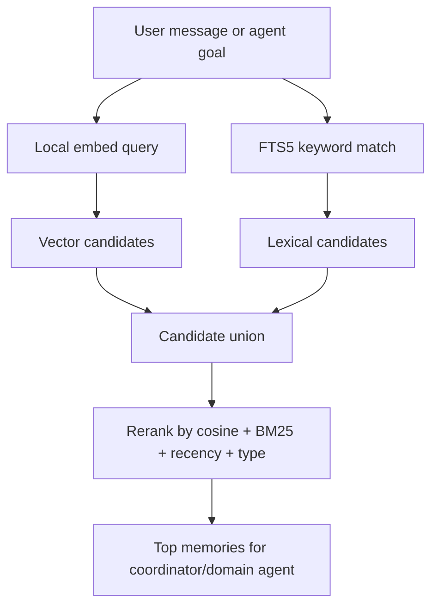
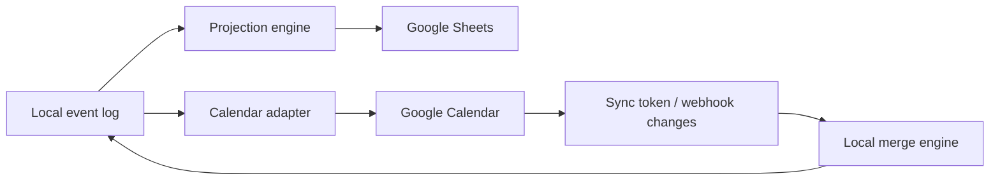
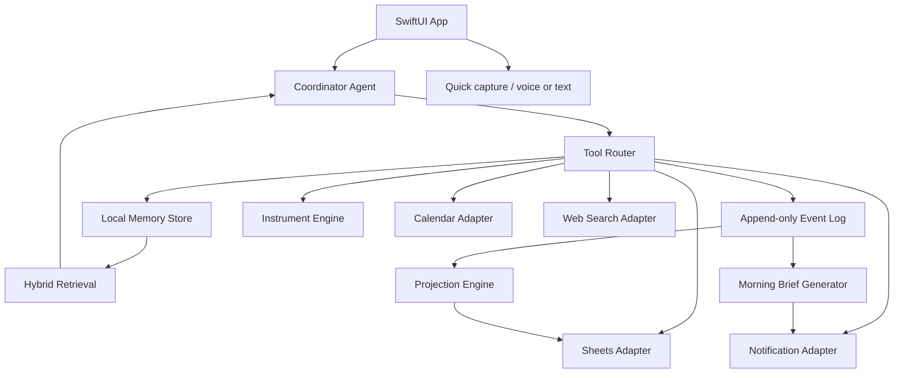

# Personal Institutional Layer for External Cognition on iPhone

## Executive summary

The core product idea is sound. The literature does not say “build a spreadsheet app with agents,” but it does support the underlying mechanism: adults with ADHD-like executive dysfunction and people struggling with self-regulation generally benefit from **externalized structure, low-friction self-monitoring, process accountability, and context-sensitive support**. What consistently fails is high-friction tracking, too many disconnected apps, too many notifications, and systems that require the user to continuously remember to maintain the system itself. Research on supportive accountability, JITAIs, ADHD workplace interventions, and digital engagement all points in the same direction: the right architecture is not “an app that stores tasks,” but **a persistent scaffolding layer that reduces activation energy, remembers commitments, checks in, and turns vague intentions into maintainable instruments.** citeturn28search14turn35view3turn35view4turn36search0turn32search0turn35view5

Technically, a single-user iPhone app can now do a large fraction of this locally. The strongest low-cost path is a **hybrid on-device system**: use Apple’s Foundation Models framework where available for summarization, extraction, light dialogue, and tool orchestration; use local embeddings for memory retrieval; keep the **source of truth on device** in SQLite; treat Google Sheets and Google Calendar as external reporting and interoperability surfaces rather than the canonical state; use iOS local notifications for reliable nudges; and treat background tasks as opportunistic refresh, not true cron. Apple’s on-device model is private, offline-capable, and free of per-token inference charges, but Apple explicitly describes it as a roughly 3B-parameter on-device model that is **not designed to be a general world-knowledge chatbot**. That is a feature here, not a bug: it is well-matched to a “life steward” that mostly routes tools, summarizes logs, extracts structured events, and nudges behavior. citeturn4search0turn4search3turn4search11

The main architectural implication is this: **do not make Sheets the ontology**. Make **an append-only local event log plus local memory store** the ontology, and let Sheets be a projection that the agents can maintain for visibility, manual editing, and experimentation. The reason is both technical and behavioral. Technically, Google Sheets is atomic for batch operations but still fundamentally collaborative and presentation-oriented; Google Calendar sync is built around incremental sync tokens; and iOS background execution is explicitly heuristic and non-deterministic. Behaviorally, the research frontier says continuity breaks when the maintenance layer becomes brittle or burdensome. So the right product is: **local event log, local retrieval, local instruments, derived Sheets, opportunistic sync, and notifications that are sparse, contextual, and accountable.** citeturn8search0turn6search2turn15search2turn15search5turn35view4

For an overnight build, the minimum viable whole product is not a toy chat app. It is a real coordinator plus tool adapters: **Coordinator chat, Event capture, Instrument creation, Memory retrieval, Sheets sync, Calendar sync, Local notifications, Morning brief, and KPI logging**. That is enough to test the true question: whether the app increases continuity, reduces executive drag, and improves real-life follow-through over days and weeks. citeturn28search14turn35view3turn36search2

## What the evidence suggests about the human problem

The best current evidence does **not** support the idea that one more generic productivity app solves this class of problem. The more defensible reading is that the target problem sits at the intersection of executive dysfunction, self-regulation failure, activation friction, and continuity breakdown. The adult-ADHD workplace review found a surprising paucity of context-specific intervention research, even though across studies interventions often showed improvements beyond symptom reduction, such as employment and relationship-related outcomes. That is important: the frontier is not “we know exactly which product to build,” but rather “the practical need is real, while the research base is still thin and fragmented.” citeturn36search0turn36search7

What *does* have better support is the mechanism of support. The supportive accountability model argues that human support improves adherence when the supporter is perceived as trustworthy, benevolent, and competent, and when expectations are clear and process-oriented rather than vague and moralizing. That maps unusually well to your intended app. An effective “personal institutional layer” should not feel like a nagging to-do list. It should feel like a reliable, context-aware, nonjudgmental operator that helps define the next concrete behavior and notices when continuity breaks. citeturn28search14

The JITAI literature reinforces that timing and burden matter as much as content. The 2026 Annual Review notes three central challenges: people may be least able to engage when they most need help, digital interventions often suffer from suboptimal engagement, and social support remains underused. The foundational JITAI framework also warns that poor engagement and burden are themselves proximal outcomes that can sink effectiveness; repeated interventions can habituate users and consume the very resources the intervention is trying to protect. In product terms: **the system has to know when to ask less, not just when to ask more.** citeturn35view3turn35view4

This is where many “should work” designs fail. Intensive self-tracking looks rational but often dies under maintenance cost. Notification-heavy systems feel helpful in onboarding but degrade into alert fatigue or learned irrelevance. App constellations also create their own tax; recent writing on app fatigue in mHealth emphasizes that too many digital health tools can create cluttered and inconsistent experiences that reduce use, especially when they require users to constantly context-switch. The continuity problem is therefore not only “remember the task,” but also “remember the system that remembers the task.” citeturn32search0turn35view5

The implication for your app is straightforward. The app should optimize for **capture ease, not ontology purity**. It should privilege **structured extraction from messy natural language** over demanding exact form-fill. It should measure success with **continuity metrics** first and outcome metrics second. And it should make the agent feel more like a patient, competent coach than like a buzzing dashboard. That is not just a design preference; it is the closest thing the evidence base gives you as a general principle. citeturn28search14turn35view3turn36search2

## Intelligence layer choices on iPhone

The on-device model landscape now splits into four real classes for your use case: Apple Foundation Models, open local LLM runtimes, Core ML–converted custom models, and broader edge runtimes such as ExecuTorch. The best answer is not “pick one forever,” but “use the cheapest and most native thing for the job, with graceful fallback.” citeturn4search0turn17search0turn17search7turn18search8

### Model and runtime tradeoffs

| Option | Strengths | Weaknesses | Best fit here |
|---|---|---|---|
| Apple Foundation Models | Native Apple integration; on-device; offline-capable; private; inference is free of per-token charges | Apple says the roughly 3B model is not meant to be a general world-knowledge chatbot | Default coordinator, summarizer, extractor, short-dialogue steward |
| llama.cpp / GGUF | Mature local-LLM ecosystem aimed at minimal-setup local inference across hardware | More app-level integration work; quality and latency depend heavily on chosen open model and quantization | Fallback when Apple model unavailable or too limited |
| Core ML–converted local models | Native Apple deployment path; can use Core ML Tools conversion and compression | Conversion can be fiddly; ops support and model architecture matter | Best path for local embedding models and potentially small task-specific models |
| ExecuTorch | Cross-platform edge runtime with hardware acceleration support | More deployment complexity for a single-user native iPhone app unless team is already PyTorch-centric | Secondary option, especially if model export pipeline already exists |

Table sources: Apple’s Foundation Models framework documentation and newsroom announcement describe offline, privacy-preserving, free on-device inference; Apple ML research identifies the on-device foundation model as roughly 3B parameters and not a general-chatbot/world-knowledge system. The llama.cpp repository positions itself as local inference with minimal setup across hardware. Core ML docs state that TensorFlow and PyTorch models can be converted to Core ML and compressed with Core ML Tools. ExecuTorch documentation positions itself as PyTorch’s on-device runtime across mobile and edge devices. citeturn4search0turn4search3turn4search11turn17search0turn17search7turn18search8turn18search3turn20search9

The practical recommendation is to use **Apple Foundation Models first** when the device and OS support them, because your app’s coordinator mostly needs to do summarization, classification, extraction, and structured tool selection. Those are exactly the types of tasks Apple lists as strong fits. If you discover later that you need heavier reasoning or more flexible prompting than Apple’s model provides, then add a local open-model fallback behind the same coordinator interface. citeturn4search3turn4search11

### Local embeddings are feasible

Yes, local embeddings make sense here. For single-user memory retrieval, you do not need a giant embedding stack. You need a **stable, cheap, low-latency encoder** that can run on device and produce consistent vectors for short notes, commitments, transcripts, and logs. Good candidates from currently available open models include:

| Embedding model | What the sources support | Why it is a good fit |
|---|---|---|
| `sentence-transformers/all-MiniLM-L6-v2` | 384-dimensional sentence embeddings for clustering and semantic search | Very plausible “first embedder” for low-latency local retrieval |
| `BAAI/bge-small-en-v1.5` | 384 dimensions, 512-token sequence length, strong English benchmark results in its model card; v1.5 improved no-instruction retrieval | Stronger retrieval-oriented default if you want better semantic recall |
| `nomic-embed-text-v1.5` | Long context; Matryoshka Representation Learning supports dimension tradeoffs with little loss | Attractive if you want adjustable dimensionality and longer notes |

Table sources: all-MiniLM model card, BGE small model card and embedded benchmark table, Nomic model card. citeturn22search0turn24view0turn25view1turn21search2turn21search23

One especially useful detail from the BGE model card is that **v1.5 improves retrieval even without instructions**, and the degradation from omitting instruction is slight. That matters on mobile because it lets you keep the embedding pipeline simple: embed both notes and queries without always prepending a retrieval instruction, unless you later find a measurable benefit on your own data. The same card also explicitly shows normalized embeddings in usage examples, which supports the usual mobile simplification that after normalization, **cosine similarity becomes dot product**. citeturn24view0turn25view1

### Core ML conversion and compression notes

Apple’s current Core ML guidance is favorable to this use case. Apple states that models from PyTorch or TensorFlow can be converted to Core ML using Core ML Tools, and its optimization stack supports palettization, pruning, and quantization. The optimization overview explicitly calls out INT4 and INT8 weight quantization options for `mlprogram` models, and Apple’s WWDC material frames these techniques as ways to materially reduce model footprint and sometimes improve on-device performance. citeturn18search8turn18search3turn20search9turn20search6turn18search0

For rough capacity planning, the simplest estimate is still useful: a model with **P** parameters occupies about `P × bytes_per_weight`, before runtime overhead. So Apple’s roughly 3B-parameter on-device model is on the order of **1.5 GB at 4-bit weights** or **3 GB at 8-bit weights**, as an approximate weight-only estimate. That is not a deployment recommendation for your own custom model; it is a reality check on why small encoder models are easy to keep local while general-purpose local LLMs need tighter runtime engineering. This estimate is an inference from Apple’s reported model scale and standard quantization math. citeturn4search3turn20search6

The implementation consequence is simple: **embed locally with a small encoder in Core ML**, keep coordinator inference on Apple Foundation Models where possible, and only bring in a fully separate open local LLM if real testing shows Apple’s model is insufficient.

## Memory and data architecture

The best storage pattern for this app is **local-first, append-only, retrieval-augmented, projection-based**. In plain language: store everything important on device first; never overwrite history if you can avoid it; retrieve relevant context for the agent instead of stuffing everything into prompts; and publish selected views to Sheets and Calendar for legibility and interoperability.

### Storage patterns that actually fit iPhone

| Storage pattern | Why it fits | Main downside | Recommendation |
|---|---|---|---|
| SQLite + FTS5 + raw vectors in app tables | Native, simple, debuggable, great for append-only event logs and keyword prefiltering | You implement vector search yourself or do brute-force over candidates | Best baseline |
| SQLite + FTS5 + `sqlite-vec` | Keeps SQLite simplicity while adding native vector search; explicit iOS support published by the project | `sqlite-vec` is still pre-v1 | Best “next step” if you want local vector search inside SQLite |
| ObjectBox Swift vector search | Native Swift SDK for iOS with on-device vector search built in | New dependency and different database model | Best alternative if team prefers higher-level SDK ergonomics |
| Qdrant | Strong vector database in general | Official docs describe a client-server architecture, which is awkward for an app-bundle-local iPhone build | Not a good first choice for this app |

Table sources: SQLite FTS5 docs, sqlite-vec repo and mobile/iOS page, ObjectBox Swift and on-device vector search docs, Qdrant overview. citeturn27search0turn26search0turn26search4turn26search3turn26search6turn26search17turn26search12

For a single-user app, SQLite remains the most robust center of gravity because it naturally supports the append-only event log you want, cheap local transactions, transparent debugging, and full-text indexing with FTS5. FTS5’s built-in BM25 ranking is valuable not because you want “search” as a visible feature, but because hybrid retrieval works better when semantic recall is mixed with lexical anchors like names, tags, domains, and explicit commitments. citeturn27search0turn26search11

### Hybrid retrieval pattern

Use a two-stage retrieval pipeline:



This is the right pattern for your app because many memories are partly semantic and partly symbolic. “Therapist wanted me to log 3 push-backs at work” is semantically similar to later notes about boundary-setting, but it is also tied to explicit domains like `work`, `therapy`, and `assertiveness`. Hybrid retrieval prevents brittle misses. The SQLite and vector-store tooling retrieved here supports the lexical and vector halves; the final reranking policy is a product recommendation. citeturn27search0turn26search4turn26search3

A good reranker for the overnight build is deliberately boring:

`score = 0.45 * cosine + 0.25 * bm25_norm + 0.20 * recency_norm + 0.10 * type_bonus`

Where `type_bonus` favors `commitment`, `constraint`, and `preference` memories over generic diary notes. This weighting is not a scientific constant; it is a rational default for a steward app.

### Memory schema

The useful memory taxonomy for this product is not “chat history versus embeddings.” It is:

- **Events**: atomic things that happened or were reported.
- **Commitments**: promised or intended future actions.
- **Instruments**: persistent choice-architecture structures like trackers, budgets, maintenance routines, or experiments.
- **Memories**: distilled durable facts, preferences, constraints, and lessons.
- **Calendar links**: time-bound items synchronized with Google Calendar.
- **Projections**: Sheets rows or summaries derived from the local log.

That schema lines up with recent agent-memory work emphasizing provenance, episodic versus semantic distinctions, and the need for explicit memory-management policies rather than infinite accumulation. I would treat those recent agent-memory proposals as emerging guidance rather than settled science, but they are directionally aligned with what a trustworthy single-user steward needs: provenance, recency, and selective retention. citeturn37search1turn37search8

A strong local schema for the first build looks like this:

| Table | Purpose | Key fields |
|---|---|---|
| `event_log` | Immutable source of truth | `event_id`, `created_at`, `actor`, `kind`, `instrument_id`, `body_text`, `payload_json`, `source`, `sheet_row_ref`, `calendar_ref` |
| `memory_items` | Durable retrievable memory | `memory_id`, `type`, `text`, `embedding`, `strength`, `last_accessed_at`, `expires_at`, `provenance_event_ids` |
| `commitments` | Actionable promises | `commitment_id`, `title`, `status`, `due_at`, `domain`, `importance`, `linked_instrument_id` |
| `instruments` | Choice-architecture objects | `instrument_id`, `name`, `kind`, `definition_json`, `state_json`, `review_cadence` |
| `sync_state` | Google sync cursors | `calendar_sync_token`, `sheet_last_sync_at`, `oauth_account_id` |
| `notification_log` | Nudge history | `notification_id`, `scheduled_for`, `delivered_at`, `acted_at`, `instrument_id`, `outcome` |

This schema is a design recommendation, but it is strongly motivated by Google’s append/update semantics, Calendar incremental sync, and the research reality that continuity requires recoverable provenance. citeturn6search2turn8search0turn37search1

### Retention and decay policy

A good stewardship app should remember selectively. The retention policy I would recommend is:

- **Events**: never delete by default; compress old events into summaries for prompt-time retrieval after a horizon like 60–90 days.
- **Commitments**: keep until completed or explicitly abandoned, then archive.
- **Instruments**: keep permanently unless deleted.
- **Preference and constraint memories**: very slow decay, almost no automatic expiry.
- **Interpretive memories** such as “I tend to bed-rot after late work nights”: medium decay unless repeatedly reinforced.
- **Search/cache memories**: fast decay.

In operational terms, each memory gets a `strength` score that increases on explicit confirmation, repeated mention, successful use in retrieval, or behavioral follow-through, and decays with time. This is not because “the brain works that way” in any literal product sense; it is because naïve memory accumulation creates context pollution, and the freshest frontier work on agent memory is moving toward explicit admission and forgetting policies for exactly that reason. citeturn37search8turn37search13

### Retrieval pseudocode

```swift
func retrieveContext(query: String, domain: String?, limit: Int = 12) -> [MemoryHit] {
    let qVec = embed(query).l2Normalize()

    // Stage one: lexical prefilter
    let lexical = fts5Search(
        text: query,
        domain: domain,
        topK: 40
    ) // returns bm25-ranked event/memory IDs

    // Stage two: semantic prefilter
    let semantic = vectorSearch(
        normalizedQuery: qVec,
        domain: domain,
        topK: 40
    ) // sqlite-vec/ObjectBox/custom cosine

    // Merge candidates
    let candidates = unionByID(lexical, semantic)

    // Load structured rows
    let items = loadMemoryItems(ids: candidates.ids)

    // Rerank
    let ranked = items.map { item in
        let cosine = dot(qVec, item.embedding)
        let bm25 = lexical[item.id]?.bm25Normalized ?? 0
        let recency = recencyScore(item.lastTouchedAt)
        let typeBonus = typeWeight(item.type)   // commitment > preference > generic note
        let score = 0.45 * cosine + 0.25 * bm25 + 0.20 * recency + 0.10 * typeBonus
        return MemoryHit(item: item, score: score)
    }.sorted(by: { $0.score > $1.score })

    return Array(ranked.prefix(limit))
}
```

This pseudocode intentionally assumes normalized embeddings, because the BGE usage examples explicitly normalize embeddings for cosine-style similarity. citeturn24view0

## Sync, scheduling, notifications, and search

### Google Sheets and Google Calendar

Google Sheets is very capable as a projection surface. The API supports `values.append` for row-wise logging, `values.batchUpdate` for writing multiple ranges at once, and `spreadsheets.batchUpdate` for structural changes like creating sheets, formatting, metadata, and other schema operations. Google documents that `spreadsheets.batchUpdate` validates all requests first and applies them atomically, though collaborative edits can still affect the final view. That combination is exactly what you want for agent-maintained dashboards: append facts, batch-update derived summaries, and optionally use developer metadata for stable markers. citeturn6search0turn8search1turn8search0turn38search0turn38search2

Google Calendar is even more straightforward for an institutional-layer app because its sync model is already designed around local state plus incremental refresh. Google’s sync guide says you do an initial full sync, persist the returned `nextSyncToken`, then use that token in later list requests to retrieve changes, including deletions. Google also offers push notifications for watched resources, but those require a public HTTPS webhook receiver. In other words: **Calendar can support near-real-time sync, but not from a pure on-device app alone.** If you want true wake-up-on-change behavior for calendar events, you need a tiny server or Mac runner that receives webhook calls, then forwards a push or writes a queue for the app. citeturn6search1turn6search2turn13search0

The right sync pattern is therefore:



Keep the **local append-only event log as source of truth**. Publish selected events to Sheets. Mirror time-bound commitments into Calendar. Pull Calendar deltas back via `syncToken`, and if you later add webhooks, treat them as wake-up signals rather than the payload source. That architecture is more robust than using Sheets or Calendar as the canonical ontology, and it is aligned with each API’s intended operating model. citeturn6search2turn8search0turn13search0

### OAuth and auth flow

Google’s iOS integration path is well-defined. Google documents Google Sign-In for iOS/macOS, and its API-access page states that the Sign-In library can handle OAuth 2.0 for access tokens. The `GIDGoogleUser` reference shows that the SDK manages granted scopes and exposes access and refresh tokens. Google’s native-app OAuth documentation also notes that installed apps do not support incremental authorization in the same generic way as some other client types, and Google’s scopes page warns that public applications accessing user data may require verification. The practical implication is to keep the initial scope set **minimal and stable**. citeturn10search0turn10search3turn10search10turn10search12turn5search7turn5search1

For your app, the recommended minimum scope set is:

- Google Sign-In identity scope via SDK
- `https://www.googleapis.com/auth/calendar`
- `https://www.googleapis.com/auth/spreadsheets`
- Prefer `drive.file` rather than broad Drive scope if you decide to create/manage app-owned spreadsheets through Drive-backed flows, because Google recommends using scopes that are as narrow as possible. citeturn5search1turn8search0turn8search1

### iOS background execution and cron reality

This is the hardest platform constraint in the whole design. Apple is explicit that the system decides when to launch background tasks, and that app refresh does **not** imply regular execution. Apple’s documentation says the system chooses the best time for background work and may give up to about 30 seconds for a background task. Apple developer forum guidance is even blunter: if you expect background refresh every 15 minutes, you will be disappointed, and there are common scenarios where you get no background time at all. Apple also positions `BGProcessingTaskRequest` as the mechanism for extended background work, often overnight, and documents options like `requiresExternalPower` and `requiresNetworkConnectivity`. citeturn15search2turn15search10turn15search5turn16search2turn16search11

So the practical cron hierarchy is:

| Mechanism | Reliability | What it is good for | What it should not do |
|---|---|---|---|
| Local notifications | High, once scheduled | Check-ins, reminders, morning brief prompts | Compute fresh state at delivery time |
| `BGAppRefreshTask` | Opportunistic | Lightweight sync, summary refresh, refreshing projections | Exact schedules or business-critical logic |
| `BGProcessingTask` | Opportunistic, often overnight | Heavier maintenance, compaction, sync catch-up | Exact user-facing deadlines |
| Tiny server / Mac runner + push | Highest for remote wakeups | Calendar webhooks, exact daily orchestration, backup nudges | Replace local-first design |

Table sources: Apple BackgroundTasks and UserNotifications docs, Apple forum guidance, Google Calendar push docs. citeturn14search1turn14search7turn15search2turn15search5turn15search10turn16search2turn16search11turn13search0

The implication is important enough to state plainly: **precise cron belongs in notifications or on a tiny remote wake-up layer, not in on-device background jobs**. The overnight build should therefore schedule tomorrow’s visible reminders *while the app is active today*, then let BGTasks merely recompute or clean up when the system allows.

### Notification design that avoids spam

The behavioral science and JITAI literature suggest three design rules.

First, **nudge the instrument, not the entire life**. A notification should be about one active structure: “You said you wanted one push-back example today. Want to log it now?” not “How is everything going?” Second, **cap burden explicitly**. If the user ignores several prompts, step down intensity, do not escalate. Third, **reward closure**. Every interaction should either log an event, snooze intelligently, or close the loop. Systems fail when notifications do not produce state transition. citeturn35view3turn35view4turn28search14

A good policy for the first build is:

- Max 3 proactive nudges per day.
- Never send two nudges within 90 minutes.
- Daily brief is one bundled notification, not many.
- Every instrument has a “quiet mode,” “light touch,” or “coach me harder” setting.
- After 3 ignored nudges in 48 hours, prompts become summary-style rather than action-style until the user reengages.

That policy is a product recommendation built from the engagement and burden evidence, rather than a directly tested formula.

### Search API options

For this product, web search is useful but not central. The coordinator needs it mainly for nutrition estimation, quick fact lookup, and lightweight exploratory research triggered by user prompts.

| Option | What the evidence here says | Fit for this app |
|---|---|---|
| SerpAPI | Real-time search API; official pricing shows $25/mo starter and $75/mo developer tiers | Best documented paid option in this pass |
| Google Custom Search JSON API | Official docs say 100 queries/day free, $5 per 1,000 beyond that; not available for new customers and discontinued for existing customers on January 1, 2027 | Avoid as a new build dependency |
| Brave Search | Brave positions Brave Search as independent and privacy-focused | Worth evaluating further, but official API pricing/details were not retrieved in this pass |
| Bing Search API | Recent reporting says Microsoft retired Bing Search APIs in August 2025 and directs developers toward other AI/Bing integrations | Not a good default for a new greenfield app |

Table sources: SerpAPI pricing page, Google Custom Search JSON API official overview, Brave official product page, reporting on Bing Search API retirement. citeturn39search0turn39search2turn39search1turn39news34turn39news35

My recommendation is to design the tool adapter so that web search is **pluggable**. For the overnight build, stub the interface and optionally wire SerpAPI if you want immediate functionality. If you want the cleanest zero-recurring-cost first pass, omit search from default flows except where clearly valuable.

## Overnight build handoff

The right overnight build is not “prototype the UI.” It is “prototype the institution.” That means shipping a narrow but complete loop: capture → structure → retrieve → nudge → review.

### Product slice

The overnight build should contain these user-visible flows:

| Flow | What it must do |
|---|---|
| Coordinator chat | Accept freeform input, decide whether to log, summarize, create/update instrument, or ask a clarifying question |
| Event ingestion | Turn natural-language updates into structured local events with optional tags and domain |
| Instrument creation | Let the coordinator create trackers/routines/budgets/check-in structures dynamically |
| Morning brief | Generate a concise daily summary from yesterday’s events, open commitments, and upcoming calendar |
| Sheets sync | Create or update one workbook with projections from local state |
| Calendar sync | Pull your next events and optionally create calendar entries for explicit commitments |
| Notifications | Schedule local nudges tied to active instruments and commitments |
| Memory retrieval | Bring back relevant past commitments, therapist asks, habits, and preferences into coordinator responses |

That is enough to test the thesis. It is *not* enough to solve life, but it is enough to know whether the app acts like external cognition rather than just another inbox.

### Recommended architecture



This is the architecture I would hand to engineers because it enforces the important separations: local truth, derived projections, retrieval as a first-class service, and adapters around every external dependency.

### Internal tool endpoints

Whether these are implemented as Swift protocols, local JSON-RPC, or a tiny in-process HTTP router is an implementation choice. The important thing is the interface contract.

#### Event capture

```json
POST /tool/event.capture
{
  "source": "chat",
  "text": "My therapist wants me to write down 3 things this week at work that I push back on and how they go.",
  "timestamp": "2026-05-16T21:12:00-04:00",
  "proposed_domain": "work"
}
```

```json
{
  "event_id": "evt_01JV...",
  "parsed": {
    "kind": "new_commitment",
    "title": "Log 3 workplace push-backs this week",
    "domain": "work",
    "tags": ["therapy", "boundaries", "work"],
    "suggested_due_at": "2026-05-23T20:00:00-04:00"
  },
  "followup_question": "Do you want a daily check-in for this, or only a reminder if nothing has been logged by tomorrow evening?"
}
```

#### Instrument creation

```json
POST /tool/instrument.create
{
  "kind": "countdown_commitment",
  "name": "Three push-backs this week",
  "definition": {
    "target_count": 3,
    "window": "week",
    "success_event_kind": "pushback_logged",
    "checkin_policy": {
      "mode": "daily_if_incomplete",
      "quiet_hours": ["22:30-08:30"]
    }
  }
}
```

#### Memory search

```json
POST /tool/memory.search
{
  "query": "therapist asked me to push back at work",
  "domain": "work",
  "limit": 8
}
```

#### Sheets projection

```json
POST /tool/sheets.project
{
  "workbook_id": "local-or-google-id",
  "projection": "daily_brief",
  "since_event_id": "evt_01JV..."
}
```

#### Calendar sync

```json
POST /tool/calendar.sync
{
  "mode": "incremental",
  "calendar_id": "primary",
  "sync_token": "stored-token-or-null"
}
```

### JSON schemas that matter

#### Event

```json
{
  "event_id": "evt_01JV1Y8B6N...",
  "created_at": "2026-05-16T21:12:00-04:00",
  "actor": "user",
  "kind": "log_entry",
  "domain": "health",
  "instrument_id": "inst_01JV...",
  "text": "Ate a turkey sandwich and chips for lunch",
  "payload": {
    "estimated_meal": true
  }
}
```

#### Memory item

```json
{
  "memory_id": "mem_01JV...",
  "type": "preference",
  "text": "Running point accumulators work well for motivation",
  "embedding_ref": "blob-or-vector-id",
  "strength": 0.92,
  "last_accessed_at": "2026-05-16T21:15:00-04:00",
  "provenance_event_ids": ["evt_01JV1Y8B6N..."]
}
```

#### Instrument

```json
{
  "instrument_id": "inst_01JV...",
  "kind": "running_accumulator",
  "name": "Productive time outside work",
  "definition": {
    "unit": "minutes",
    "daily_target": 120,
    "capture_prompt": "How much focused, productive non-work time did you do?",
    "aggregation": "rolling_daily_sum"
  },
  "state": {
    "today_total": 45,
    "seven_day_average": 62
  }
}
```

#### Commitment

```json
{
  "commitment_id": "com_01JV...",
  "title": "Research scuba certification options",
  "status": "active",
  "domain": "life_design",
  "importance": "medium",
  "due_at": null,
  "decision_needed_by": "2026-06-15T18:00:00-04:00"
}
```

### OAuth steps for engineers

The minimal Google integration handoff should say:

1. Create a Google Cloud project.
2. Enable Google Sheets API and Google Calendar API. citeturn6search1turn6search0
3. Configure an iOS OAuth client and URL scheme for Google Sign-In. citeturn10search0turn10search3
4. Use Google Sign-In SDK to authenticate and obtain user tokens. citeturn10search10turn10search12
5. Request only the scopes actually needed. citeturn5search1
6. Persist tokens/account references in Keychain; persist sync tokens in local DB. citeturn10search12turn6search2
7. For Calendar, do one full sync, store `nextSyncToken`, then move to incremental sync. citeturn6search2
8. For Sheets, create workbook/sheets on first run, then use append and batch update patterns. citeturn6search0turn8search1turn8search0

### KPIs that measure continuity impact

The true KPI is not “messages sent.” It is whether the app increases continuity and real-world follow-through. For the first month, I would track:

| KPI | Why it matters |
|---|---|
| Active days with at least one captured event | Measures continuity, not intensity |
| Commitment follow-through rate | Direct signal of whether the steward is helping |
| Instrument survival at 7 and 30 days | Tells you whether created structures remain alive |
| Morning brief open rate | Tests whether the institutional layer becomes habitual |
| Nudge action rate | Separates useful prompts from ignored noise |
| Re-entry latency after lapse | Critical executive-dysfunction measure: how fast the system helps you restart |
| Domain outcomes | Example: productive hobby hours, room reset completions, discretionary spend, weight trend |

The most important metric, in my view, is **re-entry latency after lapse**. For this problem shape, the system wins when it makes it easy to restart after a bad day instead of asking the user to recommit heroically.

### Overnight timeline

```mermaid
gantt
    title Overnight prototype plan
    dateFormat  HH:mm
    axisFormat  %H:%M
    section Core app
    SwiftUI shell and coordinator chat     :a1, 21:00, 1.5h
    Local SQLite schema and event log      :a2, after a1, 1h
    Hybrid retrieval stub                  :a3, after a2, 1h
    section Integrations
    Google Sign-In + token plumbing        :b1, 21:30, 2h
    Sheets create/append/project           :b2, after b1, 1.5h
    Calendar full sync                     :b3, after b1, 1h
    Notifications scheduling               :b4, 23:30, 1h
    section Product loops
    Instrument creation flow               :c1, 00:30, 1.5h
    Morning brief generation               :c2, after c1, 1h
    KPI logging and debug screen           :c3, after c2, 1h
    section Polish
    Dogfooding seed data + smoke test      :d1, 04:30, 1h
```



## Risks, costs, and concrete next steps

The main risks are not “can this be built?” They are sharper.

First, **background determinism**. iOS simply will not give you true cron semantics on device. If the product assumes exact background computation, it will feel flaky even when the code is correct. Mitigation: schedule visible notifications in advance, refresh opportunistically, and optionally add a tiny webhook/push relay later. citeturn15search2turn15search5turn16search11turn13search0

Second, **memory pollution**. If every chat turn becomes durable memory, retrieval quality will rot. Mitigation: memory admission control, provenance, and explicit forgetting/decay. Keep raw events immutable, but be selective about what becomes retrievable “memory.” citeturn37search1turn37search8turn37search13

Third, **notification burden**. The literature is clear that engagement can be poor even in theoretically good digital interventions, and JITAI design warns that burden can directly reduce effectiveness. Mitigation: capped nudges, quiet hours, snooze intelligence, daily bundle, and visible user control over intensity. citeturn35view3turn35view4turn36search2

Fourth, **Sheets becoming the truth**. That would create merge brittleness, auth dependence, and too much semantic meaning embedded in a presentation layer. Mitigation: local event log is truth; Sheets is read model plus manual override surface. citeturn8search0turn6search0

Fifth, **over-ambitious coordinator expectations**. Apple’s on-device model is powerful for structured app intelligence, but Apple explicitly says it is not built as a general world-knowledge chatbot. Mitigation: keep the coordinator’s job narrow—summarize, extract, retrieve, propose, notify, and route tools. Use search when outside knowledge is genuinely needed. citeturn4search3turn4search11

### Cost envelope

A realistic monthly envelope for this app is:

| Configuration | Likely recurring cost | Primary drivers |
|---|---:|---|
| Fully local, no web search | $0 | Apple on-device inference is free of per-token charges; local storage/notifications are on-device |
| Local + paid search | ~$25–$75 | SerpAPI Starter or Developer tiers |
| Local + paid search + tiny webhook/push relay | still plausibly under $100 | Search is the dominant sourced line item; relay cost depends on provider and was not sourced in this pass |

Table sources: Apple’s free on-device inference statement and SerpAPI pricing. citeturn4search0turn39search0

Google Custom Search is not a good new dependency because Google’s official docs say the JSON API is not available for new customers and is discontinued for existing customers on January 1, 2027. citeturn39search2

### Concrete next steps for engineers

The immediate handoff should be:

1. Build the local-first shell with `event_log`, `memory_items`, `commitments`, `instruments`, and `sync_state`.
2. Implement the coordinator against Apple Foundation Models if available; keep a provider interface for fallback.
3. Ship hybrid retrieval with FTS5 first; add `sqlite-vec` or ObjectBox vector search if needed.
4. Integrate Google Sign-In, Calendar full sync, and Sheets append/project.
5. Implement local notifications and morning brief generation.
6. Seed three instrument templates only as examples, not product limits: running accumulator, bounded budget, and weekly evidence log.
7. Add KPI logging and a debug screen so you can inspect continuity metrics after the first real day.

If I were making one explicit call for the overnight build, it would be this: **optimize for restartability, not completeness**. The product will prove itself if, after a bed-rot day, it makes the next day feel legible and restartable without shame.

## Open questions and limitations

A few areas remain genuinely open.

The first is **which local dialogue runtime gives the best user experience on your specific phone**: Apple Foundation Models may be enough, but this depends on device support and your tolerance for its limits as a coordinator rather than a general assistant. citeturn4search0turn4search3

The second is **embedding-runtime ergonomics on iPhone**. The sources here support local embeddings, Core ML conversion/compression, and several candidate models, but they do not settle which exact export path will be smoothest for your team’s overnight build. citeturn18search8turn20search9turn22search0turn25view1turn21search2

The third is **web-search provider choice**. SerpAPI is well-documented in the material retrieved here. Brave appears attractive on privacy grounds, but I did not retrieve its official API pricing/docs in this pass. Bing Search API also appears unsuitable for a new dependency due to its retirement. citeturn39search0turn39search1turn39news34turn39news35

The final limitation is conceptual: the research frontier does not yet provide a strong, product-ready evidence base for a personal institutional layer specifically targeted at adult executive dysfunction. What it does provide is a strong set of converging constraints about adherence, burden, accountability, timing, and continuity. That is enough to justify this app as a serious experiment, but not enough to pretend the exact design has already been validated by literature. citeturn36search13turn35view3turn28search14turn32search0